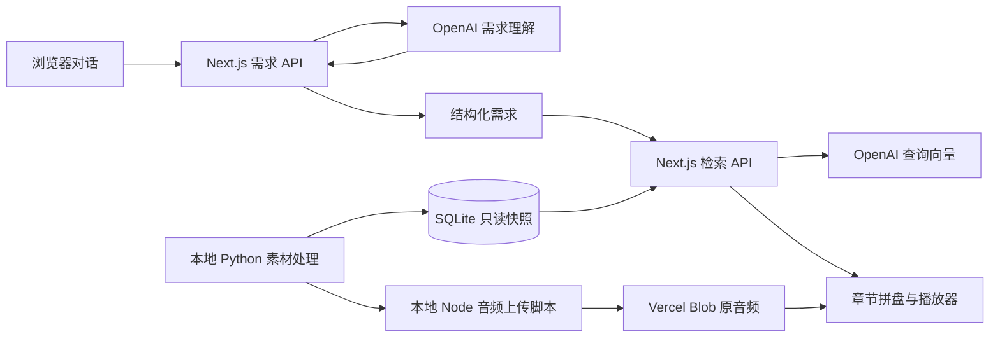

# 声签 · 调到你的频率

**世界很吵，听点与你有关的。**

通过简短对话理解此刻的困惑，从真实中文播客中检索完整主题章节，组合成 **3–5 段、10–30 分钟**的声音拼盘。播放节目原声，也可以从片段继续收听完整单集。

[体验产品](https://podcast-content-search.vercel.app) · [直接试听 Demo](https://podcast-content-search.vercel.app/demo) · [系统架构](docs/product-architecture.md)

## 可以做什么

- 输入问题、心情或困惑；必要时通过追问澄清想获得的帮助。
- 需求清楚后自动检索，按主题、帮助类型与内容形式选择完整章节。
- 暂停、拖动进度、前后跳转 15 秒、调整倍速、连续播放片段。
- 展开字幕并点击时间点，或从当前章节进入全集，再返回拼盘位置。
- 直接打开固定 Demo 体验播放；固定选段不依赖模型，也不作为动态推荐的兜底结果。

当前素材为 4 个栏目、15 期中文播客，覆盖科技与职场相关主题。共有 185 个主题章节、165 个预计算向量，其中 164 章可独立参与推荐。没有足够内容时会提示覆盖不足，不用无关片段补齐。

## 当前架构



| 部分 | 实现与职责 |
| --- | --- |
| 网页与在线 API | Next.js App Router、React、TypeScript，部署在 Vercel 的 Node.js 24 运行时 |
| 需求理解 | 模型输出检索文字、偏好标签与原话依据；结构校验后进入推荐 |
| 检索与组盘 | 查询向量召回、标签规则排序、完整章节组合，由 Node 服务端执行 |
| 数据库 | `server/data/corpus.sqlite3`，只读保存素材、字幕、时间戳、标签和已有向量 |
| 音频 | Vercel Blob 托管原始 MP3 / M4A；浏览器按时间点定位、按需缓冲播放 |
| 素材维护 | 本地 Python 负责采集、转录、分章、标注、向量化和快照导出 |

网页运行只需要 Node。数据库保存音频地址，音频文件独立存放在 Blob。已有章节向量直接复用；在线模型调用用于需求对话和当前查询向量。详细数据流见[系统架构](docs/product-architecture.md)。

## 本地运行

需要 **Node.js 24 和 npm**。仓库已包含网页运行所需的只读快照，无需准备本地音频或启动 Python。

```sh
git clone https://github.com/xinyuww/podcast-content-search.git
cd podcast-content-search
npm ci
cp .env.example .env.local
```

如需使用首页的需求对话和动态推荐，在 `.env.local` 填入自己的服务端配置：

```dotenv
OPENAI_API_KEY=your_api_key_here
```

不配置密钥也可以打开 `/demo` 试听固定拼盘；音频播放仍需联网。不要提交 `.env.local`，也不要给密钥加 `NEXT_PUBLIC_` 前缀。

```sh
npm run dev
```

打开 [http://127.0.0.1:3000](http://127.0.0.1:3000)，固定试听在 [http://127.0.0.1:3000/demo](http://127.0.0.1:3000/demo)。若本机访问模型需要代理，见[本地代理配置](docs/vercel-deployment.md#本地代理)。

本地运行生产构建：

```sh
npm run build
npm start
```

## 验证

以下检查只使用仓库中的文件，不需要调用真实模型或准备 Python 素材库：

```sh
npm run test:web
npm run typecheck
npm run lint
npm run build
npm run test:production
```

`test:production` 依赖先完成构建，启动真实 Next.js 服务，但用测试替身模拟模型响应。Python 回归、素材更新和真实模型验收属于独立维护流程，见[测试与验收](docs/testing.md)。

已发布的播放修复版本完成本地测试和构建；公开版声音已获人工试听确认。推荐质量、全部素材对齐与完整的跨浏览器体验仍有待进一步验证。

## 部署与素材更新

GitHub 的 `main` 分支推送后触发 Vercel 生产部署，其他开发分支用于 Preview。模型密钥分别配置在 Vercel 的 Production / Preview 服务端环境变量中，不放进 GitHub。

日常网页开发无需重做素材。更新语料时，在具备源数据库和音频缓存的本地环境执行 Python 流程、发布音频，再导出只读快照；云端构建只校验快照。见[Vercel 部署](docs/vercel-deployment.md)。

## 文件结构

```text
app/          页面与 /api/needs、/api/playlists、/api/demo
components/   需求对话、拼盘与播放器界面
lib/          数据契约、播放器状态与音频地址校验
server/       模型调用、检索、SQLite 快照读取
  data/       随服务端部署的只读 SQLite 与校验清单
backend/      本地 Python 素材处理、检索参考实现
scripts/      音频发布、快照校验、真实模型验收工具
data/         词表、选段清单、标注与处理报告
tests/        网页、检索对照、生产 HTTP 与 Python 测试
public/       favicon 与分享图
docs/         当前架构、功能、运行与维护说明
```

## 文档导航

- [系统架构](docs/product-architecture.md) · [文件结构与维护入口](docs/project-structure.md)
- [需求理解](docs/needs-conversation.md) · [章节索引与检索](docs/content-retrieval.md) · [动态拼盘](docs/dynamic-playlists.md)
- [固定 Demo 与播放交互](docs/functional-demo.md)
- [真实素材库](docs/real-corpus.md) · [主题切分](docs/topic-segmentation.md)
- [部署与音频发布](docs/vercel-deployment.md) · [测试与验收](docs/testing.md) · [维护与清理边界](docs/cleanup-plan.md)

## 素材与能力边界

15 期素材来自科技乱炖、编码人声、津津乐道、世界还有办法。11 期复用发布方字幕，4 期由原音频转录；字幕和内容标签尚未全量核听。当前没有明确标注为情感支持的候选，不保证任意问题都有匹配内容。

本项目按可合法使用素材的演示假设托管原音频并保留节目来源，这不构成素材授权核实。原始音频、源数据库、转录缓存和密钥不进入 Git；仓库包含服务端运行所需的派生快照与内容报告。开发场景中的检索对照不等同于真实用户效果或盲测准确率。
