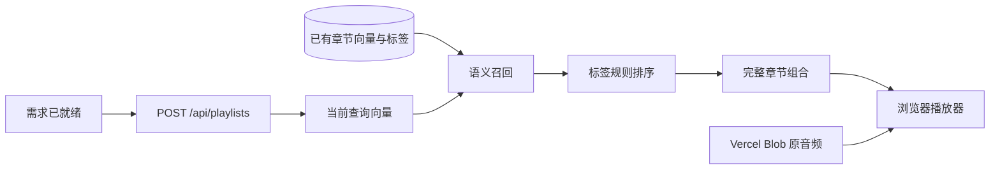

# 动态检索与拼盘

更新：2026-10-03。在线实现位于 `server/retrieval.ts`，由 Next.js `POST /api/playlists` 调用；数据来自服务端 SQLite 只读快照。

## 请求链路



前端在需求就绪后自动提交 `search_query`、`preferences`、`ready_to_recommend` 和 `taxonomy_version`。完整对话不传入检索接口。

每次动态检索为当前查询生成一个 1,536 维向量；已有 165 个章节向量从快照读取，其中 164 章可独立推荐。当前 Node 实现不使用离线查询缓存，不重新标注内容，也不进行生成式逐候选重排。

## 召回与排序

1. 归一化查询向量，计算与章节向量的余弦相似度。
2. 相似度至少 0.35，按相似度取最多 30 章。
3. 硬排除明确不想听的帮助类型和形式。
4. 在相似度上增加标签偏好覆盖奖励：帮助类型 0.10、形式 0.08、主题 0.04。

某类偏好为空则不加分。阈值和权重属于小样本调试后的启发式参数，不是相关概率。内容标注、向量输入与开发对照见 [章节索引](content-retrieval.md)。

## 组盘约束

在排序后的候选中枚举组合：

- 3–5 个完整章节，总长 600–1800 秒，不裁短章节凑时长。
- 去除重复章节，同一期中的章节不能重叠；允许同一期多个独立章节。
- 以平均排序分为主，小幅奖励节目与单集多样性，并偏好接近 20 分钟。
- 组合分 = 平均排序分 + 0.015 × 节目数 + 0.005 × 单集数 − 0.02 × 距 20 分钟的偏差 / 600。
- 播放顺序沿用检索排序，不生成串场语音或额外的叙事编排。

| API 状态 | 含义 |
| --- | --- |
| `ready` | 找到合规拼盘，已覆盖请求的正向标签 |
| `partial_match` | 拼盘可播放，但部分偏好未覆盖；响应含 `unmet_preferences`，界面显示概括提示 |
| `insufficient_coverage` | 无法组成合规拼盘，`playlist=null`，界面允许补充或调整需求 |

不会自动降低阈值或用固定示例替代无结果的动态检索。

## 音频与时间

固定和动态拼盘均返回 Blob 原音频地址，`audioUrl=episodeAudioUrl`，`audioOffset=start`。播放器在媒体元数据加载后定位到原时间点，以相对秒数显示片段进度；到章节终点暂停并切到下一段。

进入全集可以从章节起点或单集开头播放；返回拼盘恢复进入全集前的位置并暂停。全集结束不自动切换节目。浏览器按需读取远程音频数据，在线请求不裁切文件、不运行 ffmpeg。

网页使用专用 Blob 域名白名单。SQLite 和本地媒体路径不会返回给浏览器；节目来源页链接与音频播放地址是两个不同字段。

## 运行与验证

```sh
npm run dev
npm run test:web
```

只需 Node.js 24；动态推荐还需要服务端 `OPENAI_API_KEY` 和模型网络连接。查询上限 1000 字，请求体最多 16,000 字节，查询向量请求超时 35 秒；新向量仅在当前请求中使用。

两个模型相关 API 共用单实例最多 4 个活动请求的限制；这是实例级保护，不是全局限额。路由的 Vercel 执行上限声明为 60 秒。

Python 参考算法保留在 `backend/search_content.py` 和 `backend/playlist_service.py`，不被网页调用。13 个固定对照场景检查 Node 输出与已保存 Python 结果一致，不代表推荐质量已经通过独立评估。更多证据见 [测试与验收](testing.md)。
