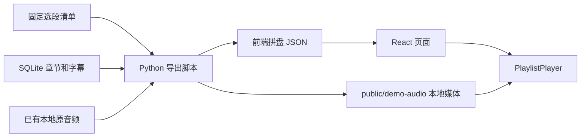

> 2026-10-01 部署迁移：当前网页与在线 API 使用 Next.js / Vercel，检索读取 `server/data/corpus.sqlite3` 只读快照，播放直接使用官方音频。本文包含旧本地服务的历史说明；当前运行方式见 [Vercel 部署](vercel-deployment.md)。

# 固定真实拼盘：功能版

本文描述固定播放器功能。2026-10-01 已增加[需求对话](needs-conversation.md)，随后已接入[动态拼盘](dynamic-playlists.md)；本文保留固定示例路径的说明，15 期素材保持不变。

## 演示流程

1. 可以先输入问题并点击「聊聊我的需求」整理需求，也可以直接点击「试听固定示例拼盘」。固定试听不依赖模型服务。
2. 得到固定的 4 段真实原声，共 19 分 13 秒。页面明确说明输入尚不参与内容选择。
3. 播放第一段或任选片段；支持暂停续播、进度拖动、前后 15 秒、倍速、上一段 / 下一段。片段结束自动进入下一段，最后一段结束显示完成。
4. 每段可「从此处听全集」（该片段在原单集中的起点）或「全集从头听」，都使用本地音频。进入全集前保存拼盘位置；返回后暂停在原位置，点击播放继续。
5. 可展开发布方字幕，点击原始时间点试听；也可打开节目原页面。返回需求对话会暂停音频，保留上一份拼盘入口；再次点击固定试听会重置收听状态。

刷新页面会回到首页，本版没有跨刷新持久化或账号功能。播放状态由单一控制器管理，切换来源时停止旧音频；加载失败显示重试按钮，不静默跳过。

## 固定素材

| 节目 | 章节 | 原单集范围 | 片段时长（约） |
| --- | --- | --- | --- |
| 世界还有办法 | 就业市场的系统性替代 | 08:14.85–12:23.75 | 4:09 |
| 科技乱炖 | 调研发现：程序员写代码时间不足20% | 09:22.65–14:31.39 | 5:09 |
| 科技乱炖 | 从辅助编程到激发创造 | 00:53.55–06:31.53 | 5:38 |
| 津津乐道 | 怎么评估AI投入有没有效：先找最小闭环 | 16:06.41–20:24.13 | 4:18 |

标题与边界取自已有数据库章节，简介为人工整理的内容说明，未生成个性化匹配理由。字幕原文未改写，仍可能有识别错误；整体核听工作尚未完成。

## 运行与数据路径

```bash
npm run demo:prepare
npm run dev -- --hostname 127.0.0.1 --port 3000
```

`demo:prepare` 依赖 Python 3、ffmpeg / ffprobe、`data/podcasts.sqlite3` 与对应的本地原音频，不使用 API key，也不访问外网。



- 片段重新编码为 MP3，文件名关联源文件哈希、边界与编码版本。全集 MP3 优先硬链接以减少重复占用；源文件实际为 MP4/AAC 时无损重封装为 M4A 并前置索引。
- 媒体由现有 Vite 静态服务提供，不需要额外 Python 服务或数据库 API；支持 HTTP Range 时浏览器可以直接定位全集。
- 生成文件在 `public/demo-audio/`，已加入 `.gitignore`。前端构建会复制这些本地媒体到构建产物；本版仅用于本地演示，不应直接把整个构建目录上传。
- `data/demo-playlist.json` 是导出快照；修改选段后重新运行准备脚本。
- 动态拼盘通过新增本地服务返回兼容结构，复用播放控制器；前端仍不直接连接 SQLite 或持有 API key。

## 验证

`npm test` 包含 13 项播放与素材断言、9 项需求服务断言、生产构建和 SSR / Worker 路由检查。播放测试覆盖连续播放、暂停恢复、全集返回、速度继承、边界定位、加载失败重试及旧请求的竞态隔离。`npm run lint` 检查应用代码，排除本地 Python 依赖缓存。

本次浏览器验证通过输入提交、空白校验、本地原声播放、进度跳转触发自动下一段、完整单集定位、返回原位置和最后片段完成状态；8 个媒体地址的 HTTP Range 均返回 206 和正确音频类型。自动化浏览器点击响应不稳定，这轮交互主要通过键盘触发，仍建议在常用浏览器用鼠标 / 触屏走一遍。

`npm run typecheck` 检查 TypeScript。原模板缺少 Cloudflare 运行时类型，已补充生成的 `worker-runtime.d.ts`；将来修改 Worker 配置后，先构建再运行 `npm run types:generate` 更新。

人工浏览器验收可按上面的演示流程操作；这些检查不能代替不同浏览器的音频兼容性和全部内容核听。

## 深夜电台界面（2026-10-01）

已将首页、需求对话、结构确认、拼盘与播放器统一为墨蓝底色、暖灰文字、琥珀色操作的深夜电台风格。按选中的原始深夜电台方案恢复黑胶唱片及柔和背景。桌面首页左侧唱片、右侧文案与输入；拼盘页左侧唱片、右侧曲目，底部横向播放器。手机端保留唱片并改为上下排列，播放器位于片段列表之前。使用常规系统字体，黑胶保持静止。片段简介、字幕和来源可展开查看，完整单集入口仍保留。主文案保留「调到你的频率」「世界很吵。听点与你有关的。」以及「告诉我此刻的困惑，把几段值得听的声音，交给接下来的二十分钟。」品牌名暂保留声签，等待命名选择。

Web 回归 34 项、生产构建、TypeScript 和 ESLint 通过。浏览器检查覆盖 1280px 桌面和 390px 手机宽度，均无横向溢出；验证了空输入反馈、示例输入、固定拼盘、原声播放、进入全集与返回拼盘。真实模型对话验收仍暂停。
