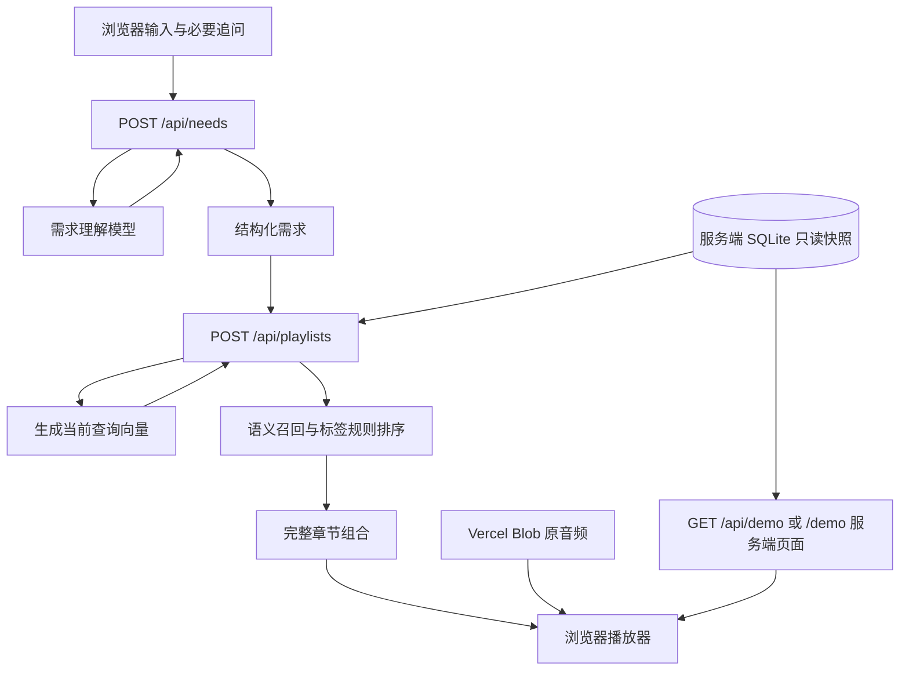

# 当前系统架构

更新：2026-10-03。本文描述已发布的 Next.js / Vercel 版本；代码基线为 `3aec4da`。

## 运行组成

网页、需求对话和检索 API 都由 Next.js 的 Node.js 24 服务执行。在线数据来自只读 SQLite 快照，原音频由 Vercel Blob 提供。Python 留在本地素材维护与参考实现中，不参与公开网站的请求链路。

| 层 | 入口 | 职责 |
| --- | --- | --- |
| 页面 | `app/page.tsx`、`app/demo/page.tsx` | 首页需求对话、独立固定试听页面 |
| 界面 | `components/`、`lib/player.ts` | 对话、拼盘、字幕与播放状态 |
| 需求 API | `app/api/needs/route.ts`、`server/needs.ts` | 调用需求模型，校验结构和原话引用 |
| 检索 API | `app/api/playlists/route.ts`、`server/retrieval.ts` | 查询向量、候选排序和拼盘组合 |
| 固定 Demo | `app/api/demo/route.ts`、`server/snapshot.ts` | 从快照返回固定选段，不调用模型 |
| 服务端数据 | `server/data/corpus.sqlite3` | 只读保存章节、字幕、标签与向量 |
| 音频存储 | Vercel Blob | 独立托管 MP3 / M4A 原文件 |
| 离线处理 | `backend/`、音频发布脚本 | 采集、转录、分章、标注、向量化和快照导出 |

## 在线数据流

需求 API 接收完整对话，每轮重新生成当前需求。前端只展示必要的追问，不展示内部 JSON；当 `ready_to_recommend=true` 时自动向检索 API 提交 `search_query`、`preferences`、准备状态与词表版本。检索 API 不接收完整对话。

每次动态检索为当前查询调用一次 embedding API，内容向量直接从快照读取。当前 Node 实现不保存或读取离线查询缓存；也不在召回后逐段调用生成式模型重排。缺少合规组合时返回覆盖不足，固定 Demo 是单独入口。

## 两份 SQLite 的边界

| 数据 | 本地源库 `data/podcasts.sqlite3` | 在线快照 `server/data/corpus.sqlite3` |
| --- | --- | --- |
| 使用方 | 本地 Python 工具 | Node 服务端 |
| 更新方式 | 显式素材处理命令写入 | 本地导出后随代码发布，运行时只读 |
| 内容 | 来源、缓存路径、字幕、原章节、派生索引与处理记录 | 在线所需的素材、章节、字幕、标签、向量与固定拼盘 |
| 是否进入 Git | 否 | 是 |
| 是否向浏览器下载 | 否 | 否；仅通过 API 返回必要的播放数据 |

快照共 6 张表：

| 表 | 内容 |
| --- | --- |
| `metadata` | Schema、词表、向量模型、维度、源库哈希和统计 |
| `episodes` | 15 期节目与 Blob 音频地址 |
| `chapters` | 185 章及标注，164 章标为独立可推荐 |
| `embeddings` | 165 个 1,536 维向量 |
| `transcript_cues` | 4,157 条字幕及原始时间 |
| `demo` | 固定 4 段拼盘 |

`server/snapshot.ts` 以只读方式打开数据库，并检查 Schema、词表与向量模型。章节记录可缓存在服务端实例内存中；新查询向量不写回快照。`next.config.ts` 将快照纳入两个数据 API 和 `/demo` 页面所需的服务端文件。

## 音频与用户状态

片段和全集使用同一个 Blob 地址。播放器通过 `audioOffset=start` 把原单集时间换算成片段内进度，播放到章节终点后切换下一段。音频不存入 SQLite，不经过 Next.js 音频代理，不依赖节目官方播放服务器。官方页面链接仅用于查看来源。

对话、需求、拼盘和播放位置保存在浏览器当前组件内存中。返回首页会重开需求流程，刷新不恢复会话；从全集返回拼盘会恢复之前的位置并暂停。当前没有账户、收藏、播放历史或跨设备同步。

## 本地维护与发布

本地源库 → 主题章节与索引 → 音频上传 Blob → 导出 SQLite 快照 → Vercel 部署。

源内容变化时，离线索引流程负责拒绝过期标注或向量；云端运行校验发布快照，不接触源库。`backend/search_content.py` 与 `backend/playlist_service.py` 保留作本地参考，网页实际检索和组盘逻辑位于 `server/retrieval.ts`。13 个固定场景用于检查两套算法结果的一致性。

运行命令见 [README](../README.md)，部署细节见 [Vercel 部署](vercel-deployment.md)，当前证据与限制见 [测试与验收](testing.md)。
