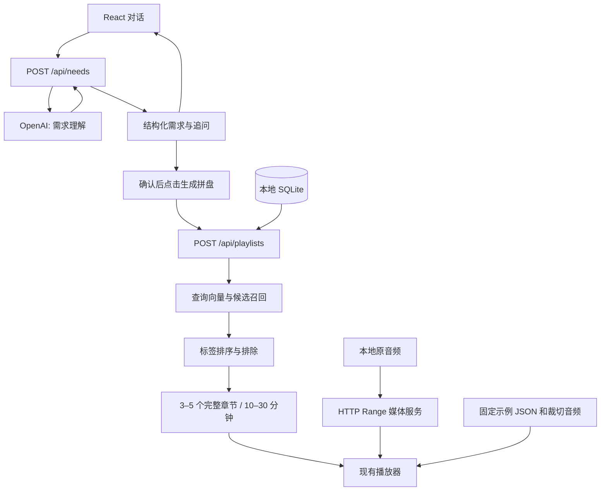
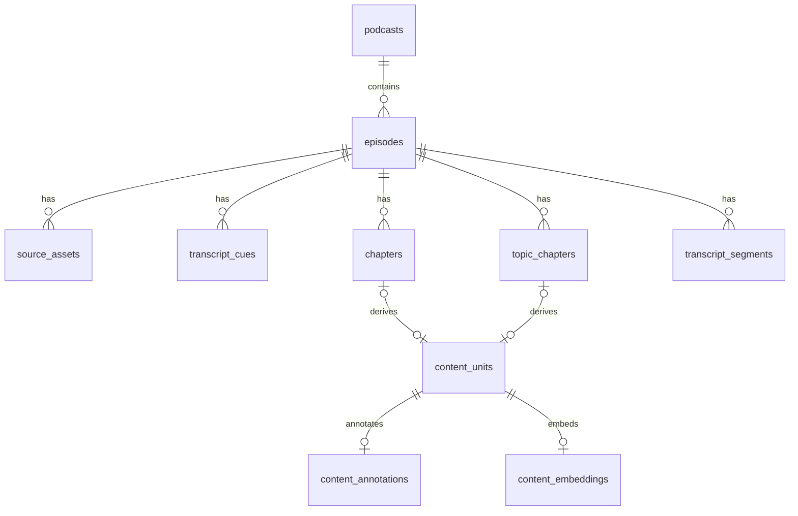

> 2026-10-01 部署迁移：当前网页与在线 API 使用 Next.js / Vercel，检索读取 `server/data/corpus.sqlite3` 只读快照，播放直接使用官方音频。本文包含旧本地服务的历史说明；当前运行方式见 [Vercel 部署](vercel-deployment.md)。

# 声签：当前架构与模块职责

更新日期：2026-10-01。以当前源码和本地 SQLite 为准。15 期素材固定，未公开部署。

## 1. 当前组成

**React 前端 + vinext 页面 / 需求服务 + 本地 Python 检索与媒体服务 + SQLite + 本地原音频。** 结构化需求到动态拼盘已接通；外部 OpenAI 网络验收按用户要求暂停，当前验证使用已有查询缓存。

| 层 | 实现 | 职责 |
| --- | --- | --- |
| 前端 | React 19、TypeScript、CSS | 对话、需求结构与纠正、动态拼盘、片段 / 全集播放 |
| 页面与需求 API | vinext / Vite、Worker 入口、`server/needs.ts` | 渲染页面；`POST /api/needs` 调用模型整理需求 |
| 本地检索与媒体服务 | Python `ThreadingHTTPServer`，127.0.0.1:8766 | `POST /api/playlists` 检索与组盘；`GET/HEAD /media/episodes/<id>` 原音频分段读取 |
| 素材库 | `data/podcasts.sqlite3` | 节目、字幕、章节、标注和向量；在线请求只读 |
| 文件系统 | `data/raw/`、`public/demo-audio/` | 15 期原音频及来源文件；固定演示的裁切媒体 |
| 离线处理 | Python、ffmpeg / ffprobe、模型 API | 选集、转录、主题分段、标注、向量化、媒体检查和固定演示导出 |

项目使用 Next 风格 `app/` 布局，但由 vinext / Vite 启动构建。没有 Supabase、D1 / Drizzle、独立向量数据库或用户账户。

## 2. 用户流程

需求对话收到完整 `messages`，每轮重新生成当前需求。检索仅收到 `search_query + preferences`、准备状态及词表版本，不收到完整对话。准备就绪后由用户点击生成；有未发送的修改时不能使用旧需求生成拼盘。

新查询通过与内容侧相同的 embedding 模型生成查询向量；已有缓存可以直接复用。无足够相关章节或无法满足段数 / 时长约束时明确返回不足，不用固定片段冒充匹配结果。部分标签未覆盖时展示缺项。

## 3. 服务接入与启动

`npm run dev` 运行 `scripts/dev.mjs`，同时启动 Python 服务和 vinext。Python 绑定端口成功后才启动页面；任一服务退出时停止另一服务。`PODCAST_OFFLINE=1 npm run dev` 仅禁止检索生成新查询向量，不会让对话模型离线运行。

开发 Worker 不能直接连接宿主机 loopback，所以开发模式的 `/api/playlists` 和 `/media/episodes/` 由 Vite 的 Node 代理转发。生产构建的本地 Node 服务通过 `server/corpus.ts` 固定转发到 127.0.0.1:8766。`worker/index.ts` 还负责 `/api/needs` 和页面分流。

这是当前本地演示架构。代码依赖本机 SQLite 和音频文件；若以后迁到云端，需要重新安排持久化存储、媒体 URL 和后端运行环境，不能直接把 loopback 服务视为云端数据库连接。

## 4. 前端与共享模块

| 文件 | 职责 |
| --- | --- |
| `app/page.tsx` | 薄页面入口，装配产品组件 |
| `components/listening-experience.tsx` | 对话 / 结果视图、动态或固定拼盘状态、卡片与播放器界面 |
| `components/needs-conversation.tsx` | 对话、纠正、取消、JSON 导出 / 恢复、按需求生成拼盘、失败与覆盖不足提示 |
| `lib/player.ts` | 唯一活动音频、相对 / 绝对时间换算、章节边界连播、全集与拼盘位置恢复 |
| `lib/needs.ts` | 共享标签 Schema、需求与原话引用校验、已导出需求恢复 |
| `lib/playlist.ts` | 拼盘数据契约、段数 / 时长 / 音频 URL 的前端校验 |
| `data/demo-playlist.json` | 原固定 4 段真实演示，约 19 分 13 秒，作为独立试听入口保留 |
| `app/globals.css`、`app/layout.tsx` | 样式与页面外壳 |

动态片段直接读取原音频，`audioOffset=start` 将原单集秒数映射成片段内进度；到章节终点暂停并切换。固定片段使用裁切文件，offset 默认为 0。全集播放结束不会自动切换节目。返回对话会暂停并保留拼盘位置，新拼盘替换时释放旧音频。

共享辅助函数在 `backend/common.py`，项目根路径在 `backend/paths.py`。在线 Python 模块不依赖离线 `pipelines/`；Python 工具通过 `python -m backend.…` 运行。

## 5. 后端与处理工具

| 文件 | 职责 |
| --- | --- |
| `server/needs.ts` | 对话提示词、Responses API、结构校验、超时 / 错误处理 |
| `server/corpus.ts` | 受限路由的本地服务桥接，流式传递音频 Range 响应 |
| `backend/playlist_service.py` | 校验需求、调用检索、枚举合规章节组合、返回播放器数据、媒体服务 |
| `backend/search_content.py` | 向量召回最多 30 段、标签硬排除与加权排序、离线检索评测 |
| `backend/content_index.py` | 统一内容单元、摘要标签、embedding、缓存恢复与过期检查 |
| `backend/pipelines/segment_topics.py` | 无发布方章节的 4 期节目按完整字幕生成主题边界 |
| `backend/corpus.py` | 源数据建表、入库、检查、早期关键词检索 |
| `backend/pipelines/export_demo_playlist.py` | 固定演示的 JSON、片段和全集媒体导出 |
| `backend/pipelines/transcribe_openai.py`、`transcribe_local.py` | 转录工具；当前 15 期无需重做 |
| `backend/pipelines/verify_local_audio.py`、`audit_transcripts.py`、`build_audio_review.py` | 音频 / 字幕检查与核听页 |
| `backend/pipelines/prepare_expansion.py`、`finalize_corpus.py` | 已完成的 5→15 期素材扩充历史工具 |

检索未使用逐候选生成式重排：余弦相似度门槛 + 标签规则。组盘在候选中枚举 3–5 段，保持完整章节、总长 600–1800 秒、同一期章节不重叠；以相关性为主并小幅偏好节目多样性和约 20 分钟。细节见 [动态拼盘](dynamic-playlists.md)。

## 6. 数据库：10 张表

| 表 | 行数 | 内容 |
| --- | ---: | --- |
| `podcasts` | 4 | 栏目、语言和来源 |
| `episodes` | 15 | 单集标题、时长、所属栏目和来源页面 |
| `source_assets` | 45 | 15 音频 + 15 字幕 + 11 章节文件 + 4 转录来源记录；路径、哈希和来源信息 |
| `transcript_cues` | 4,157 | 精细字幕原文、说话人及起止时间 |
| `chapters` | 140 | 11 期发布方章节 |
| `topic_chapters` | 45 | 4 期模型划分且经文本边界复查的主题章节 |
| `transcript_segments` | 431 | 早期字幕窗口，保留但不作为当前检索单位 |
| `content_units` | 185 | 统一章节、原文、边界、来源哈希与审核状态 |
| `content_annotations` | 185 | 摘要、场景、类型、主题 / 帮助 / 形式标签与字幕依据 |
| `content_embeddings` | 165 | 1,536 维 float32 向量及模型、输入哈希；默认 164 段可独立检索 |

SQLite 是普通本地文件，不需要单独的数据库守护进程。源表由 `corpus.py` 管理；主题章节由 `segment_topics.py` 管理；统一单元、标注与向量由 `content_index.py` 管理。单元和标注使用关联字段及 JSON payload；向量为 BLOB，由 Python 遍历计算相似度。

源字幕或章节变化会使派生索引过期；服务拒绝使用过期向量。重建顺序：源素材入库 → 恢复主题章节 → 统一单元 → 标注 → embedding。原 15 期素材约 16.86 小时，11 期发布方字幕、4 期 API 转录；逐段核听与标注全量语义审核仍未完成。

## 7. 数据保存在哪里

| 数据 | 位置 / 生命周期 |
| --- | --- |
| 15 期原音频、字幕、来源文件 | `data/raw/`；Git 忽略；不可当普通缓存删除 |
| 正式素材清单与词表 | `data/collection.json`、`data/content-taxonomy.json` |
| 标注及修订导出 | `data/content-annotations.json`、`data/content-annotation-reviews.json` |
| 原固定演示媒体 | `public/demo-audio/`；Git 忽略 |
| 动态拼盘媒体 | 直接读取原文件，不重复裁切或写媒体文件 |
| 用户对话、需求、拼盘、播放进度 | 当前浏览器内存；刷新清空；主动导出可保存 JSON |
| 网页新查询向量 | 当前请求中使用，不新增磁盘缓存；可复用已有离线缓存 |
| API 密钥 | `.env.local` 或服务端环境；不发送到浏览器 |

没有用户、会话、播放历史或拼盘持久化表。媒体 URL 只接受已登记 episode ID，并限制真实路径在原音频目录内；支持 Range、HEAD 和实际容器 MIME。

## 8. 当前验证与未完成项

已完成本地缓存需求 → 网页检索请求 → 真实章节拼盘 → 原音频播放的联调，包含章节自动切换、全集返回、MP3 与 MP4/AAC。新对话 / 新查询的 OpenAI 网络验收仍暂停，代理未配置；未做公开部署。推荐权重是启发式初版，不等同于真实用户效果评测。

运行和数据契约见 [动态拼盘](dynamic-playlists.md)；对话结构见 [需求理解](needs-conversation.md)；目录导航见 [文件结构](project-structure.md)。旧 D1 / Drizzle / Supabase 与登录模板已删除，记录见 [清理清单](cleanup-plan.md)。
